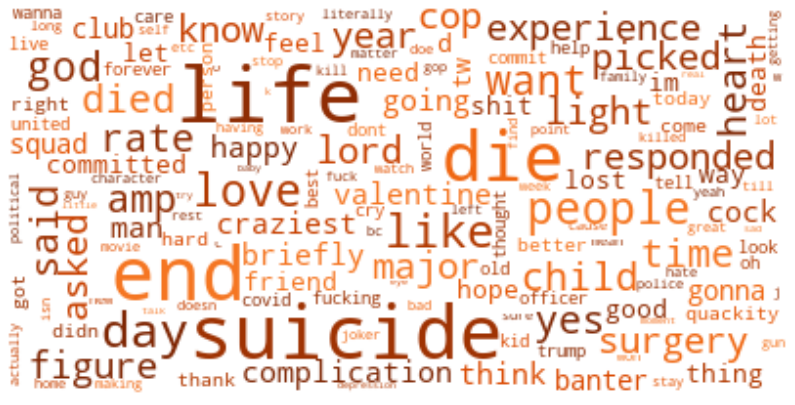
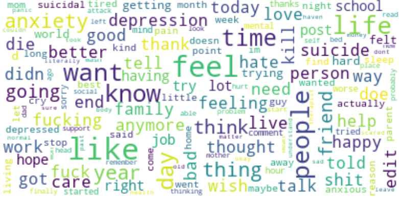

# AI For Social Good

## Suicidal Ideation Detection In Online Social Content

---

## Getting Started

The rise of social media and online communities creates safe and anonymous spaces for individuals to share their thoughts about their mental health and express their feelings and sufferings in online communities. To prevent suicide, it is necessary to detect suicide-related posts and user's suicide ideation in cyberspace by natural language processing methods. I focused on the online community called Reddit and the social networking website Twitter, and classify user's posts with potential suicide and without suicidal risk through text features processing, machine learning, and deep learning based methods.

## Datasets

Collected two sets of data from Reddit and Twitter. The Reddit data set includes (2958) suicidal ideation samples and a number of non-suicide texts (5381). The Twitter dataset has a total (3000) tweets with suicidal ideation.
Reddit Data was scraped from subreddits like 'suicide watch', 'depression', 'anxiety' etc. Twitter data was collected by querying keywords like 'end my life', 'die' etc.

**The Twitter word cloud (left) and Reddit word cloud (right) are shown as follow:**

 
 &nbsp; &nbsp;
 

## Feature Processing and Training

- Performed text cleaning and removed some corpus-specific stopwords. And plotted word cloud to visualize the frequently occurring words in a corpus.
- Performed vectorization using Both Bag of Words and TFIDF Vectorizer.
- Used grid search cv to find the best parameters to train the model using Random Forest Classifier and archived an accuracy of 96%.
- Trained the model using Multilayer Bidirectional LSTM with GLOBE embedding to attain an accuracy of 97%.

## Results

Results of different methods applied

| Model        | Acc. | Pre. | Rec. | F1   |
| ------------ | ---- | ---- | ---- | ---- |
| RF + TFIDF   | 0.96 | 0.96 | 0.96 | 0.96 |
| LSTM + GLOBE | 0.97 | 0.97 | 0.97 | 0.97 |

## Usage

- `Dataset` : All the collected and cleaned dataset
- `Data_Collection` : Code for scraping data from reddit and twitter
- `Src` : All The source code for text preprocessing and building ml models
- `Pretrained_Models` : All the Pretrained Models and tokenizers

## License

Distributed under the MIT License. See `LICENSE` for more information. 
